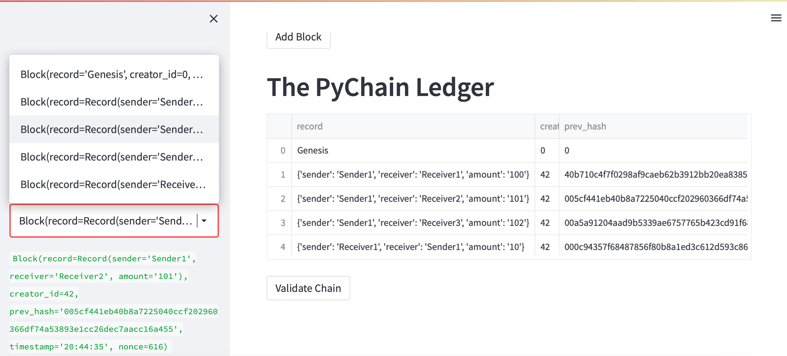

# PyChain Ledger

Build a blockchain-based ledger system, complete with a user-friendly web interface. This ledger should allow partner banks to conduct financial transactions (that is, to transfer money between senders and receivers) and to verify the integrity of the data in the ledger.

As per the assignment, the following steps were incorporated

1. Create a Record Data Class

2. Modify the Existing Block Data Class to Store Record Data

3. Add Relevant User Inputs to the Streamlit Interface

4. Test the PyChain Ledger by Storing Records

### Step 1: Created a Record Data Class

Defined a new Python data class named `Record`. Give this new class a formalized data structure that consists of the `sender`, `receiver`, and `amount` attributes. To do so, complete the following steps:

### Step 2: Modified the Existing Block Data Class to Store Record Data

Renamed the `data` attribute in your `Block` class to `record`, and then set it to use an instance of the new `Record` class that you created in the previous section. To do so, complete the following steps:

### Step 3: Added Relevant User Inputs to the Streamlit Interface

Coded additional input areas for the user interface of your Streamlit application. Created these input areas to capture the sender, receiver, and amount for each transaction that you’ll store in the `Block` record. To do so, complete the following steps:

### Step 4: Tested the PyChain Ledger by Storing Records

Tested the complete `PyChain` ledger and user interface by running the Streamlit application and storing some mined blocks in your `PyChain` ledger. Then tested the blockchain validation process by using your `PyChain` ledger. To do so, complete the following steps:

---

### Screenshot of the data stored in ledger

---

### Screenshot of the verification result

---

### Link to the video on you tube that provides an overview of the application

---
### The view recording is also checked in the repo and the name is ScreenRecording_18_BlockChain.mov

